# Features

Everything d2 blocks does, one short clip each. The clips are recorded from the
real app by [`scripts/record-features.mjs`](../scripts/record-features.mjs), so
they can be re-shot whenever the UI changes.

**Editing** — [Build with blocks](#build-with-blocks) ·
[Edit or paste d2](#edit-or-paste-d2) ·
[Connections that can't invent boxes](#connections-that-cant-invent-boxes) ·
[Shapes are roles](#shapes-are-roles) · [Groups and nesting](#groups-and-nesting) ·
[Styles](#styles) · [Rich text labels](#rich-text-labels) · [Undo and redo](#undo-and-redo)

**Seeing it** — [3D look](#3d-look) · [Hover links both sides](#hover-links-both-sides) ·
[Layout, direction and sketch](#layout-direction-and-sketch) ·
[Themes and appearance](#themes-and-appearance) ·
[Tables, classes, code, icons and tooltips](#tables-classes-code-icons-and-tooltips) ·
[Sequence diagrams](#sequence-diagrams) · [Layers, scenarios and steps](#layers-scenarios-and-steps)

**In and out** — [Examples gallery](#examples-gallery) · [Mermaid import](#mermaid-import) ·
[Export](#export) · [Language](#language)

---

## Build with blocks

Add a box, give it a name, pick what it is, connect it. Every block is one d2
statement, so the source below the canvas is the file a developer would have
written by hand.

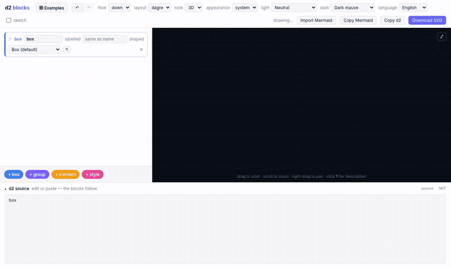

## Edit or paste d2

The source pane is an editor too. Type or paste d2 and the blocks rebuild
themselves. Anything the blocks can't represent — classes, vars, globs, tables,
arrowhead maps — stays as a grey `d2` block holding the text verbatim, so a
pasted file comes back byte-for-byte.

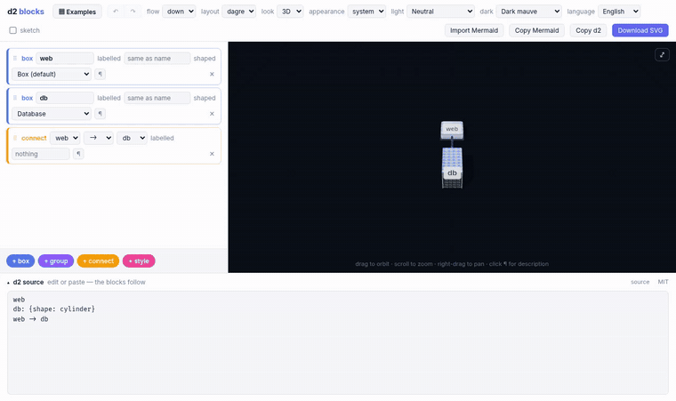

## Connections that can't invent boxes

In d2 a typo in `a -> b` silently *creates* a new box. Here both ends are
dropdowns of shapes that exist, so that can't happen. Deleting a box takes its
connections and styles with it for the same reason.

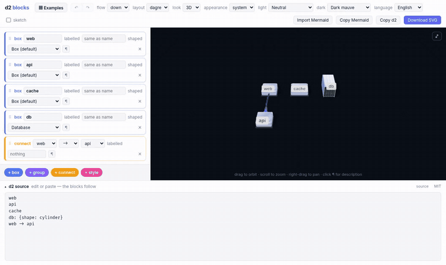

## Shapes are roles

The shape list says what people draw — *Database*, *Queue*, *User*, *Cloud* —
rather than `cylinder` or `person`; the source still gets d2's own name. In 3D
each one is a physical object: a server rack, a transport tube, a figure.

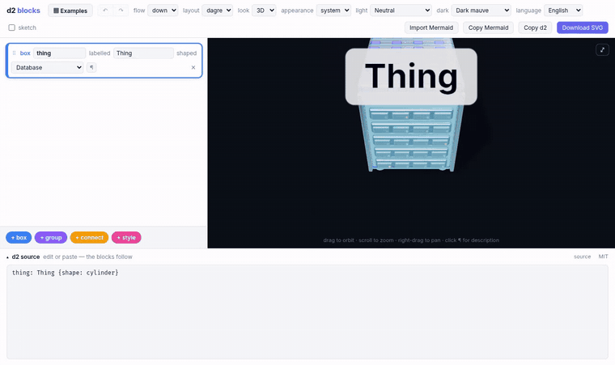

## Groups and nesting

Groups are d2 containers. Drag a block into one (or use the arrow keys on its
grip); in 3D a group is a platform its children stand on.

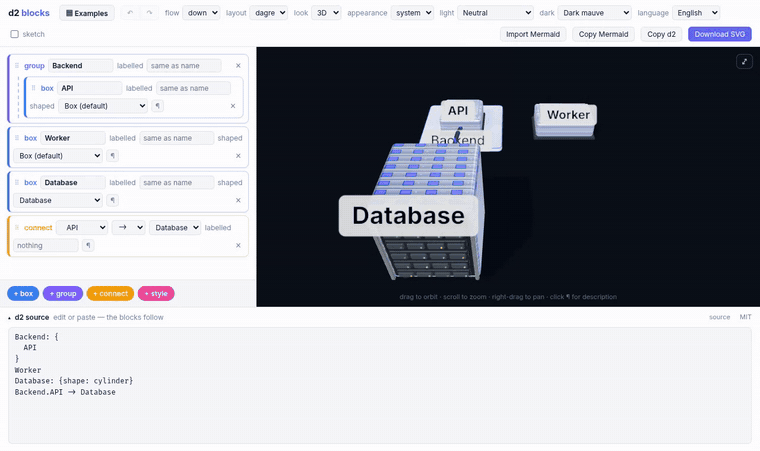

## Styles

A style block sets one property on one shape, with an editor that only accepts
what d2 accepts: a colour picker for fill, checkboxes for flags, a list for
patterns.

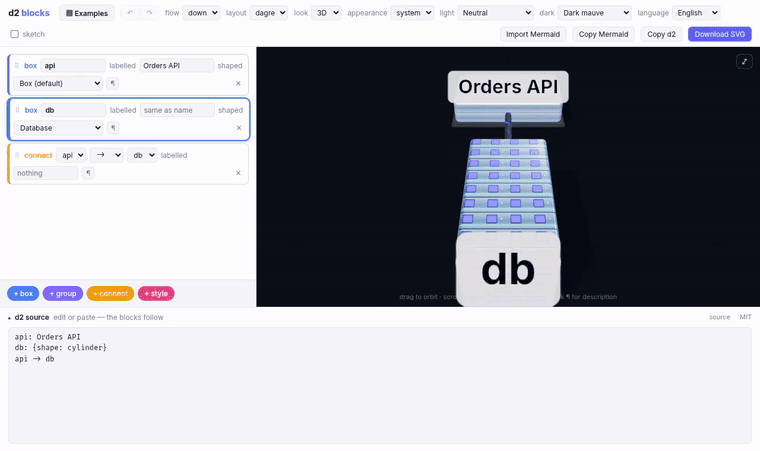

## Rich text labels

`¶` turns any label into markdown with a small editor — headings, bold, lists,
links. It's stored as an ordinary d2 block string.

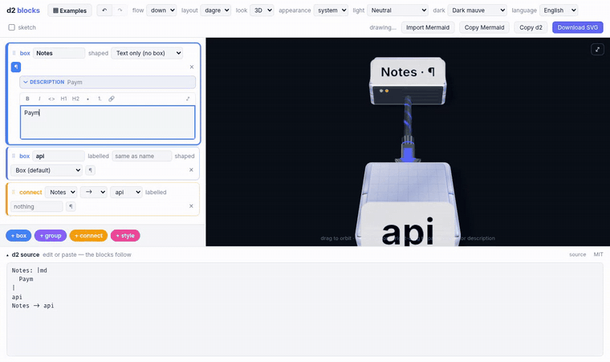

## Undo and redo

Every edit — from blocks or from the source pane — is one step of history.

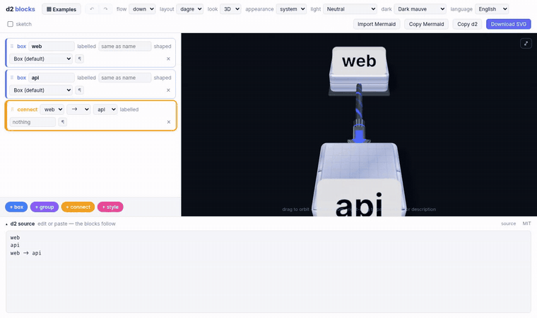

## 3D look

d2 does the layout; the scene builds real solids from it, lit and shadowed, with
an orbit camera. Drag to orbit, scroll to zoom, right-drag to pan.

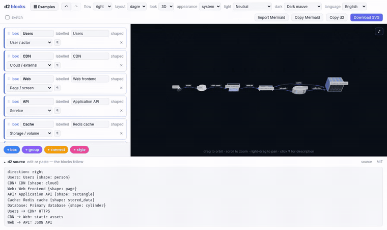

## Hover links both sides

Pointing at a block lights up its object, in 3D and flat alike, and pointing at
an object lights up its block.

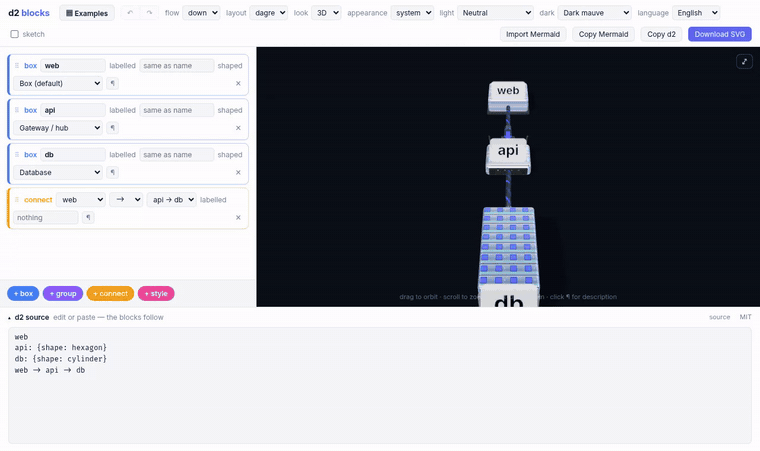

## Layout, direction and sketch

Choose the flow direction, the layout engine (dagre or ELK) and d2's hand-drawn
sketch mode.

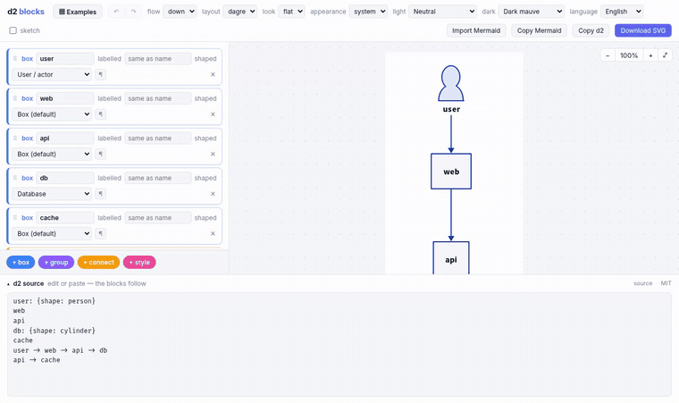

## Themes and appearance

All of d2's light and dark palettes, applied to both looks. Appearance follows
the system or can be forced light or dark.

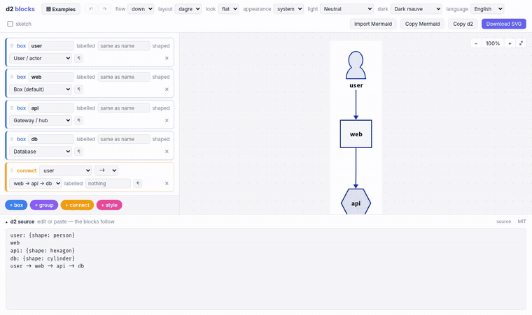

## Tables, classes, code, icons and tooltips

SQL tables, UML classes, code and LaTeX keep d2's own drawing on top of a slab.
Icons float over their object, tooltips show on hover, and every d2 arrowhead —
crow's feet included — is real hardware on the cable.

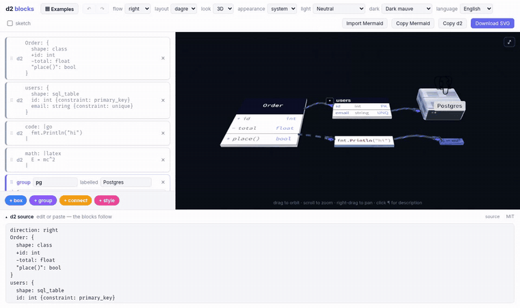

## Sequence diagrams

Actors stay objects, lifelines become dashed rails, messages run between them.

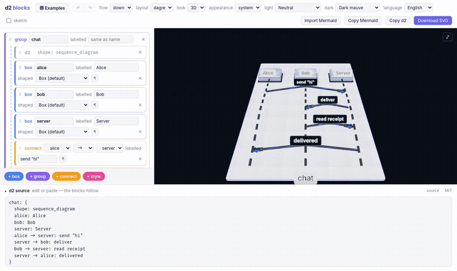

## Layers, scenarios and steps

A file with `layers`, `scenarios` or `steps` gets a **board** picker in the
toolbar. Each board renders in either look; a d2 `link` to a board switches to it.

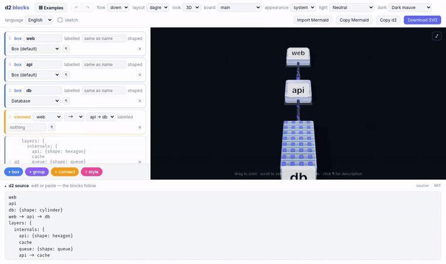

## Examples gallery

Thirty-odd ready-made architectures, filtered by category or search, each with a
live preview. Loading one is a single undo away.

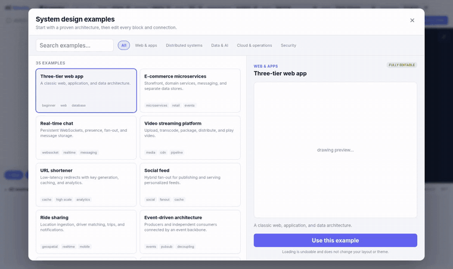

## Mermaid import

Paste a mermaid flowchart, check the preview, import it as blocks. **Copy
Mermaid** goes the other way.

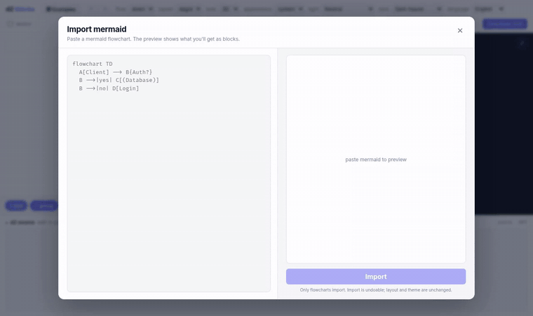

## Export

**Copy d2** puts the source on the clipboard, **Copy Mermaid** a flowchart of it,
and **Download SVG** saves d2's own render.

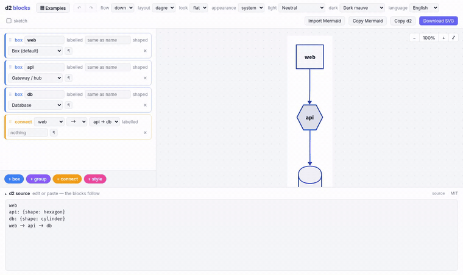

## Language

The interface is in English and Russian, and remembers your choice.

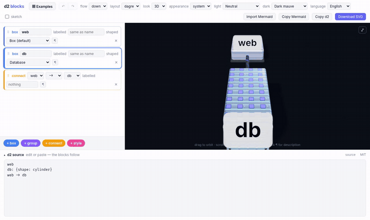
